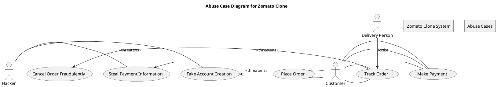
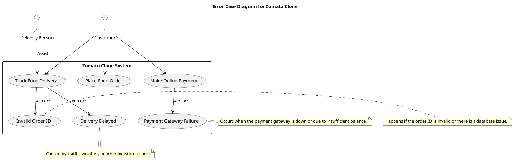

# **Use Case Diagrams**

## 1. Happy Case Diagram

---

## 2. Abuse Case Diagram

### **PlantUML Code**

```plantuml
@startuml
title Abuse Case Diagram for Zomato Clone

actor "Customer" as C
actor "Delivery Person" as D
actor "Hacker" as H

usecase "Place Order" as UC1
usecase "Track Order" as UC2
usecase "Make Payment" as UC3

usecase "Fake Account Creation" as AC1
usecase "Steal Payment Information" as AC2
usecase "Cancel Order Fraudulently" as AC3

rectangle "Zomato Clone System" {
    UC1 - C
    UC2 - C
    UC3 - C
}

rectangle "Abuse Cases" {
    AC1 <- UC1 : <<threatens>>
    AC2 <- UC3 : <<threatens>>
    AC3 <- UC2 : <<threatens>>
}

H - AC1
H - AC2
H - AC3

C - UC1
C - UC2
C - UC3

D --> UC2 : Assist
@enduml
```

### Reference

---

## 3. Error Case Diagram

### **PlantUML Code**

```plantuml
@startuml
title Error Case Diagram for Zomato Clone

actor "Customer" as Customer
actor "Delivery Person" as DeliveryPerson

rectangle "Zomato Clone System" {
    usecase "Place Food Order" as PlaceOrder
    usecase "Track Food Delivery" as TrackDelivery
    usecase "Make Online Payment" as MakePayment

    usecase "Payment Gateway Failure" as PaymentFailure
    usecase "Invalid Order ID" as InvalidOrder
    usecase "Delivery Delayed" as DeliveryDelay
}

' Relationships between actors and use cases
Customer --> PlaceOrder
Customer --> TrackDelivery
Customer --> MakePayment

' Error cases linked to relevant use cases
MakePayment --> PaymentFailure : <<error>>
TrackDelivery --> InvalidOrder : <<error>>
TrackDelivery --> DeliveryDelay : <<error>>

' Delivery person assists with tracking deliveries
DeliveryPerson --> TrackDelivery : Assist

' Notes to provide context for each error case
note right of PaymentFailure
Occurs when the payment gateway is down or due to insufficient balance.
end note

note left of InvalidOrder
Happens if the order ID is invalid or there is a database issue.
end note

note bottom of DeliveryDelay
Caused by traffic, weather, or other logistical issues.
end note
@enduml
```

---
